# VBC - Video Batch Compression

**Production-grade batch video compression tool with real-time UI and event-driven clean architecture.**

VBC compresses video libraries to AV1 using GPU (NVENC) or CPU (SVT-AV1) with intelligent queue management, camera-specific quality presets, and automatic rotation. Built for photographers, videographers, and content creators managing large video collections.

---

[](https://www.python.org/downloads/)
[](LICENSE)
[](docs/)
[](tests/)

---

## Table of Contents

- [Why VBC?](#why-vbc)
- [Key Features](#key-features)
- [Demo & Screenshots](#demo--screenshots)
- [How It Works](#how-it-works)
- [Quick Start](#quick-start)
- [Installation](#installation)
- [Configuration](#configuration)
- [Usage](#usage)
  - [CLI Reference](#cli-reference)
  - [Runtime Controls](#runtime-controls)
- [Architecture](#architecture)
- [Advanced Features](#advanced-features)
- [Troubleshooting](#troubleshooting)
- [Development](#development)
- [Contributing](#contributing)
- [License](#license)

---

## Why VBC?

Modern video libraries grow fast. Raw 4K footage from cameras and drones consumes terabytes of storage. VBC solves this with:

- **Massive Space Savings**: AV1 codec achieves 30-70% size reduction vs H.264/HEVC
- **Quality Preservation**: Perceptually lossless compression with configurable quality targets
- **Batch Efficiency**: Process thousands of files with smart queue management and parallel processing
- **Camera Intelligence**: Apply different quality settings per camera model automatically
- **Real-Time Control**: Adjust threads, monitor progress, gracefully stop/resume without losing work

**Perfect for**: Photographers with mixed camera libraries, drone pilots with rotated footage, content creators archiving projects, anyone with 500GB+ of video needing organization.

---

## Key Features

### Compression & Quality
- ✅ **AV1 Encoding**: GPU (NVENC) for speed or CPU (SVT-AV1) for maximum quality
- ✅ **Dynamic CQ**: Camera-specific quality presets (e.g., Sony A7RV at CQ38, DJI at CQ45)
- ✅ **Smart Filtering**: Skip AV1-already-encoded files, filter by camera model, size thresholds
- ✅ **Min Ratio Check**: Keep original if compression savings below threshold (default 10%)
- ✅ **Color Space Fixes**: Automatic recovery for FFmpeg 7.x "reserved" color space bugs

### Processing & Performance
- ✅ **Multi-Threaded**: 1-16 concurrent compressions with dynamic adjustment
- ✅ **Submit-on-Demand**: Memory-efficient queue (doesn't load 10K futures upfront)
- ✅ **Metadata Caching**: Thread-safe cache avoids redundant ExifTool calls
- ✅ **Hardware Detection**: Automatic GPU capability error detection with optional CPU fallback
- ✅ **Graceful Shutdown**: Finish active jobs cleanly (Ctrl+S) or immediate interrupt (Ctrl+C)

### Intelligence & Automation
- ✅ **Auto-Rotation**: Regex-based filename pattern matching (GoPro, DJI, iPhone patterns)
- ✅ **Deep Metadata**: EXIF/XMP/GPS preservation + custom VBC tags (original size, CQ, encoder)
- ✅ **Queue Refresh**: Re-scan directory mid-run to pick up new files
- ✅ **Error Markers**: `.err` files track failures with optional cleanup/retry
- ✅ **Resume Capability**: Automatically skip already-compressed files

### User Experience
- ✅ **Rich TUI Dashboard**: 6-panel real-time interface with live statistics
- ✅ **Keyboard Controls**: Adjust threads (`<`/`>`), refresh (`R`), shutdown (`S`) without stopping
- ✅ **GPU Monitoring**: Sparkline visualizations for utilization, memory, temperature, power
- ✅ **Demo Mode**: Simulate full runs without touching files (perfect for testing configs)
- ✅ **Progress Tracking**: Throughput (files/hour), ETA, per-job progress

---

## Demo & Screenshots
### Interactive Dashboard


The dashboard provides real-time visibility into:
- **Status Panel**: Files discovered, compression progress, thread count
- **Active Jobs Panel**: Currently processing files with codec, FPS, size, elapsed time
- **Recent Completions**: Last 5 finished jobs with compression ratio
- **Queue Panel**: Next 5 files to process with camera model and size
- **Summary**: Overall stats (success, errors, hardware limits, skipped files)
- **GPU Sparklines** (if enabled): Real-time utilization, memory, temperature, power draw

### Configuration Overlay


Press `C` to toggle configuration view showing:
- Input/output directory mappings
- Encoder settings (GPU/CPU, threads, quality)
- Camera-specific quality overrides
- Auto-rotation patterns
- Active filters and thresholds

### Runtime Controls


Dynamic thread adjustment while processing:
- Press `.` or `>` to increase threads (instant response)
- Press `,` or `<` to decrease threads
- UI shows immediate feedback: "Threads: 4 → 8"

### Screenshot Gallery

<table>
  <tr>
    <td width="33%"><br/><b>Dashboard</b></td>
    <td width="33%"><br/><b>Settings [C]</b></td>
    <td width="33%"><br/><b>Shortcuts [M]</b></td>
  </tr>
  <tr>
    <td><br/><b>I/O Folders [F]</b></td>
    <td><br/><b>Reference [L]</b></td>
    <td><br/><b>TUI Settings [T]</b></td>
  </tr>
  <tr>
    <td><br/><b>Thread Decrease</b></td>
    <td><br/><b>Graceful Shutdown [S]</b></td>
    <td><br/><b>Compact Mode</b></td>
  </tr>
</table>

---

## How It Works

### Architecture Overview

VBC follows **Clean Architecture** with strict layer separation and event-driven communication:


### Core Concepts

**Submit-on-Demand Queue Pattern**
- Only queues `prefetch_factor × threads` jobs (not all 10,000 files)
- Submits new jobs as workers complete
- Memory-efficient for large directories
- Responsive to runtime thread adjustments

**Thread-Safe State Management**
- Condition variables for dynamic concurrency control
- Graceful shutdown coordination (finish active jobs)
- Queue refresh signaling without race conditions

**Event-Driven Architecture**
- EventBus decouples Pipeline from UI
- 16 event types (JobStarted, JobCompleted, DiscoveryFinished, etc.)
- Pydantic events ensure type safety and immutability
- Extensible: add new subscribers without modifying publishers

---

## Quick Start

### Prerequisites
- Python 3.12+
- FFmpeg 6.0+ with AV1 support (`av1_nvenc` and/or `libsvtav1`)
- ExifTool (optional but recommended for metadata)
- `uv` package manager

### First Run

```bash
# Install dependencies
cd /path/to/vbc
uv sync

# Run VBC on a directory
uv run vbc /path/to/videos
```

### What Happens

1. **Discovery**: Scans `/path/to/videos` for video files (`.mp4`, `.mov`, `.avi`, `.flv`, `.webm`)
2. **Output Created**: Creates `/path/to/videos_out/` directory automatically
3. **Compression**: Starts processing with defaults (1 thread, CQ 45, GPU mode)
4. **Dashboard**: Shows real-time progress, active jobs, queue, and summary

### Check Results

```bash
# View compressed files
ls -lh /path/to/videos_out/

# Check logs
cat /tmp/vbc/compression.log

# View metadata (if ExifTool installed)
exiftool -XMP-vbc:all /path/to/videos_out/compressed_video.mp4
```

**Expected Output Structure**:
```
/path/to/videos/              # Input
├── video1.mp4
├── video2.mov
└── subfolder/
    └── video3.avi

/path/to/videos_out/          # Output (auto-created)
├── video1.mp4                # Compressed to AV1
├── video2.mp4                # Compressed (converted to .mp4)
├── subfolder/
│   └── video3.mp4            # Compressed
└── failed_video.err          # Error marker (if compression failed)
```

---

## Installation

### System Requirements

| Requirement | Version | Purpose |
|-------------|---------|---------|
| **Python** | 3.12+ | Runtime |
| **FFmpeg** | 6.0+ | Video encoding (with `av1_nvenc` or `libsvtav1`) |
| **ExifTool** | Any recent | Metadata extraction (optional but recommended) |
| **nvidia-smi** | - | GPU monitoring (NVIDIA GPUs only) |
| **OS** | Linux, macOS, Windows (WSL) | Platform support |

### Step 1: Install System Dependencies

#### Ubuntu/Debian
```bash
sudo apt update
sudo apt install ffmpeg libimage-exiftool-perl
ffmpeg -codecs | grep av1  # Verify AV1 support
```

#### macOS
```bash
brew install ffmpeg exiftool
ffmpeg -codecs | grep av1
```

#### Arch Linux
```bash
sudo pacman -S ffmpeg perl-image-exiftool
```

### Step 2: Install UV Package Manager

```bash
curl -LsSf https://astral.sh/uv/install.sh | sh
```

### Step 3: Install VBC

```bash
# Clone repository
git clone https://github.com/your-org/vbc.git
cd vbc

# Install dependencies (automatic via uv)
uv sync

# Verify installation
uv run vbc --help
```

### Step 4: GPU Support (Optional)

For NVIDIA GPU acceleration:

```bash
# Verify NVIDIA driver
nvidia-smi

# Verify NVENC support in FFmpeg
ffmpeg -codecs | grep nvenc
# Should show: av1_nvenc, hevc_nvenc, h264_nvenc
```

**NVENC Session Limits** (important for thread count):
- **RTX 30-series**: ~5 concurrent sessions → max 4-5 threads
- **RTX 40-series** (e.g., RTX 4090): 10-12 sessions → max 10-12 threads
- **Professional GPUs** (Quadro, A-series): Higher/unlimited → max 8-16 threads

**10-bit AV1**: Requires RTX 40-series or newer.

### Verification

```bash
# Test with a small video
uv run vbc /path/to/test/video --threads 1 --cq 45

# Run demo mode (no file I/O)
uv run vbc --demo
```

Full installation details: [docs/getting-started/installation.md](docs/getting-started/installation.md)

---

## Configuration

### Configuration File

Default: `conf/vbc.yaml`

Create configuration file for persistent settings:

<details>
<summary>📋 Full configuration example (<code>conf/vbc.yaml.example</code>) - Click to expand</summary>

```yaml
# VBC Configuration Example
# All available parameters with descriptions

# --- Input/Output Settings ---

# List of directories to scan for videos.
# CLI argument overrides this (no merge).
input_dirs:
  - /path/to/videos
  - /another/path

# Explicit output directories (one per input directory, in order).
# Must have the same count as input_dirs.
# Cannot be used if suffix_output_dirs is set.
output_dirs: []

# Suffix appended to each input directory name to create output directory.
# Example: /videos -> /videos_out
# Default: "_out"
suffix_output_dirs: "_out"

# Explicit directories for failed files (one per input directory, in order).
# Cannot be used if suffix_errors_dirs is set.
errors_dirs: []

# Suffix appended to each input directory name for failed files.
# After processing, failed source files and their .err markers are moved here.
# Default: "_err"
suffix_errors_dirs: "_err"

# --- General Settings ---

general:
  # Max concurrent compression threads (1-16).
  # Can be adjusted at runtime with < and > keys.
  threads: 4

  # Default constant quality (0-63). Lower = better quality, larger files.
  # Recommendations: 35-38 (Archival), 40-45 (High), 48-52 (Good).
  cq: 45

  # Submit-on-demand queue multiplier (1-5).
  # Formula: max_queued = prefetch_factor * threads.
  prefetch_factor: 1

  # Use GPU acceleration (NVENC AV1) if true, otherwise CPU (SVT-AV1).
  gpu: true

  # GPU polling interval in updates per second (legacy, see gpu_config).
  gpu_refresh_rate: 5

  # Processing order: name, rand, dir, size, size-asc, size-desc, ext.
  queue_sort: "name"

  # Optional seed for deterministic random queue sorting.
  queue_seed: null

  # Path to log file. Default: /tmp/vbc/compression.log
  log_path: "/tmp/vbc/compression.log"

  # Retry on CPU if NVENC hits hardware capability error.
  cpu_fallback: false

  # Max CPU threads per FFmpeg worker (null = auto).
  ffmpeg_cpu_threads: null

  # Copy EXIF/XMP/GPS tags from source to output.
  copy_metadata: true

  # Use ExifTool for deep metadata analysis (required for dynamic_cq/filtering).
  use_exif: true

  # Only process specific camera models (substring match, case-insensitive).
  # Example: ["Sony", "DJI"]
  filter_cameras: []

  # Camera-specific CQ values (First match wins).
  # Example: {"ILCE-7RM5": 38, "Sony": 40}
  dynamic_cq: {}

  # File extensions to scan and process.
  extensions:
    - ".mp4"
    - ".mov"
    - ".avi"
    - ".flv"
    - ".webm"

  # Minimum input file size in bytes to process (Default: 1 MiB).
  min_size_bytes: 1048576

  # Remove existing .err markers on startup and retry those files.
  clean_errors: false

  # Skip files already encoded in AV1 codec.
  skip_av1: false

  # Replace non-ASCII characters with '?' in UI to prevent alignment issues.
  strip_unicode_display: true

  # Global rotation override (null, 0, 90, 180, 270).
  manual_rotation: null

  # Minimum compression savings required (0.0-1.0).
  # If compression < 10%, keep original file instead of compressed version.
  min_compression_ratio: 0.1

  # Enable verbose debug logging.
  debug: false

# --- GPU Monitoring Settings ---

gpu_config:
  # Enable GPU monitoring panel and sparklines.
  enabled: true

  # How often to sample GPU metrics (seconds).
  sample_interval_s: 5.0

  # Total time window shown in sparklines (seconds).
  history_window_s: 300.0

  # Index of the GPU device to monitor.
  nvtop_device_index: 0

  # Optional: specific device name to monitor (overrides index).
  nvtop_device_name: null

# --- UI Settings ---

ui:
  # Max events shown in the activity feed panel (1-20).
  activity_feed_max_items: 5

  # Max concurrent jobs to display in the active panel (1-16).
  active_jobs_max_display: 8

  # Vertical scaling factor for dashboard panels (0.3-1.0).
  panel_height_scale: 0.7

# --- Auto-Rotation Settings ---

autorotate:
  # Regex pattern -> Rotation angle (0, 90, 180, 270).
  # First match wins.
  patterns:
    "GOPR\d+\.MP4": 180
    "IMG_\d{4}\.MOV": 90
```

</details>

### Directory Mapping Modes

**Mode 1: Suffix (Default)**
```yaml
input_dirs:
  - /videos
suffix_output_dirs: _out       # Creates /videos_out
suffix_errors_dirs: _err       # Creates /videos_err
```

**Mode 2: Explicit (1:1 Pairing)**
```yaml
input_dirs:
  - /videos
  - /drone_footage
output_dirs:
  - /compressed/videos
  - /compressed/drone
suffix_output_dirs: null       # Disable suffix mode
```

**CLI Override**:
```bash
# CLI input always overrides config input_dirs (no merge)
uv run vbc /custom/path        # Ignores config input_dirs
```

Full configuration reference: [docs/getting-started/configuration.md](docs/getting-started/configuration.md)

---

## Usage

### Basic Commands

```bash
# Process directory with defaults
uv run vbc /path/to/videos

# GPU mode with 8 threads
uv run vbc /path/to/videos --gpu --threads 8

# CPU mode for archival quality
uv run vbc /path/to/videos --cpu --cq 35 --threads 4

# Custom config file
uv run vbc /path/to/videos --config conf/production.yaml

# Camera-specific processing
uv run vbc /path/to/videos --camera "Sony,DJI" --cq 38

# Rotate all videos 180°
uv run vbc /path/to/videos --rotate-180

# Clean error markers and retry failed files
uv run vbc /path/to/videos --clean-errors

# Debug mode with verbose logging
uv run vbc /path/to/videos --debug --threads 2
```

### CLI Reference

| Flag | Type | Default | Description |
|------|------|---------|-------------|
| `INPUT_DIR` | Positional | - | Directory to process (or comma-separated list) |
| `--config`, `-c` | Path | `conf/vbc.yaml` | Configuration file |
| `--threads`, `-t` | Integer | From config (1) | Max concurrent threads |
| `--cq` | Integer | From config (45) | Constant quality (0-63, lower=better) |
| `--gpu` / `--cpu` | Boolean | `--gpu` | Use GPU (NVENC) or CPU (SVT-AV1) |
| `--queue-sort` | String | `name` | Queue order (`name`, `rand`, `dir`, `size`, `ext`) |
| `--queue-seed` | Integer | None | Seed for deterministic random order |
| `--skip-av1` | Boolean | False | Skip AV1-encoded files |
| `--camera` | String | All | Filter by camera model (comma-separated) |
| `--min-size` | Integer | 1048576 | Min file size in bytes |
| `--min-ratio` | Float | 0.1 | Min compression ratio (10% savings) |
| `--rotate-180` | Boolean | False | Rotate all videos 180° |
| `--clean-errors` | Boolean | False | Remove .err markers and retry |
| `--log-path` | Path | `/tmp/vbc/compression.log` | Log file path |
| `--debug` | Boolean | False | Verbose debug logging |
| `--demo` | Boolean | False | Simulation mode (no file I/O) |
| `--demo-config` | Path | `conf/demo.yaml` | Demo simulation settings |

**Configuration Precedence**: CLI args > YAML config > defaults

Full CLI reference: [docs/user-guide/cli.md](docs/user-guide/cli.md)

### Runtime Controls

While VBC is running, use these keyboard shortcuts:

| Key | Action | Description |
|-----|--------|-------------|
| `<` or `,` | Decrease threads | Reduce max concurrent threads by 1 (min: 1) |
| `>` or `.` | Increase threads | Increase max concurrent threads by 1 (max: 16) |
| `S` or `s` | Graceful shutdown | Stop accepting new jobs, finish active ones (press again to cancel) |
| `R` or `r` | Refresh queue | Re-scan directory and add new files |
| `C` or `c` | Toggle config | Show/hide configuration overlay |
| `Esc` | Close overlay | Close configuration overlay |
| `Ctrl+C` | Immediate interrupt | Terminate all active jobs immediately |

**Thread Adjustment**: Changes take effect instantly. New jobs start as slots become available.

**Graceful Shutdown**: Press `S` to stop queue, let active jobs finish. Press `S` again to cancel shutdown and resume.

**Queue Refresh**: Press `R` to re-scan input directory. New files added to queue without duplicating existing ones.

Full runtime controls guide: [docs/user-guide/runtime-controls.md](docs/user-guide/runtime-controls.md)

---

## Architecture

### Clean Architecture Layers

```
┌─────────────────────────────────────────────────┐
│                  UI Layer                       │
│  Dashboard, KeyboardListener, UIState           │
│  (Rich library, terminal rendering)             │
└────────────────┬────────────────────────────────┘
                 │ Events (Pub/Sub via EventBus)
┌────────────────┴────────────────────────────────┐
│              Pipeline Layer                     │
│  Orchestrator (job lifecycle, queue, threads)   │
└────────────────┬────────────────────────────────┘
                 │ Domain Models (VideoFile, Job)
┌────────────────┴────────────────────────────────┐
│          Infrastructure Layer                   │
│  FFmpeg, ExifTool, FFprobe, FileScanner         │
│  (External tool adapters)                       │
└─────────────────────────────────────────────────┘
```

**Benefits**:
- **Testability**: Mock infrastructure adapters easily
- **Maintainability**: Change UI without touching pipeline logic
- **Extensibility**: Add new event subscribers (webhooks, logging) without modifying publishers

### Job Lifecycle

```mermaid
stateDiagram-v2
    [*] --> Discovery: Scan directory
    Discovery --> Queued: Files found
    Queued --> Processing: Thread slot available
    Processing --> Compressed: FFmpeg success
    Processing --> Failed: FFmpeg error
    Processing --> HW_CAP: GPU capability exceeded
    Processing --> Interrupted: Ctrl+C
    Compressed --> MetadataCopy: Copy EXIF/XMP
    MetadataCopy --> RatioCheck: Compare sizes
    RatioCheck --> Completed: Savings ≥ threshold
    RatioCheck --> Original_Kept: Savings < threshold
    Completed --> [*]
    Original_Kept --> [*]
    Failed --> [*]: .err marker written
    HW_CAP --> [*]: .err marker written
    HW_CAP --> Queued: CPU fallback enabled
    Interrupted --> [*]: .tmp cleanup
```



### Event Flow

All components communicate via **EventBus** (synchronous pub/sub):

**Discovery Phase**:
```
Orchestrator → DiscoveryStarted → UIManager → Update UI
Orchestrator → DiscoveryFinished → UIManager → Show file counts
```

**Job Processing**:
```
Orchestrator → JobStarted → UIManager → Add to active jobs panel
FFmpegAdapter → JobCompleted → UIManager → Update stats, move to recent
FFmpegAdapter → JobFailed → UIManager → Increment error counter
```

**User Control**:
```
User presses '>' → KeyboardListener → ThreadControlEvent → Orchestrator → Increase threads
User presses 'S' → KeyboardListener → RequestShutdown → Orchestrator → Graceful shutdown
User presses 'R' → KeyboardListener → RefreshRequested → Orchestrator → Re-scan directory
```

Architecture deep dive: [docs/architecture/overview.md](docs/architecture/overview.md)

---

## Advanced Features

### Dynamic CQ (Camera-Specific Quality)

Apply different quality settings per camera model:

```yaml
general:
  cq: 45  # Default for unknown cameras

  dynamic_cq:
    "ILCE-7RM5": 38      # Sony A7R V - highest quality
    "DC-GH7": 40         # Panasonic GH7 - high quality
    "DJI OsmoPocket3": 48  # DJI Pocket 3 - standard quality
```

**How it works**:
1. VBC extracts full EXIF metadata via ExifTool
2. Searches all metadata fields for camera model strings
3. First match wins (order matters in YAML)
4. Applies custom CQ instead of default

**Example**:
- File: `IMG_1234.MOV`
- EXIF: `Model = "ILCE-7RM5"`
- Result: Uses CQ 38 instead of default 45

### Auto-Rotation

Automatically rotate videos based on filename patterns:

```yaml
autorotate:
  patterns:
    "DJI_.*\\.MP4": 0          # DJI drones - no rotation needed
    "GOPR\\d+\\.MP4": 180      # GoPro - flip upside down
    "IMG_\\d{4}\\.MOV": 90     # iPhone - rotate 90° clockwise
```

**Rotation Angles**:
- `0` = No rotation
- `90` = Clockwise (transpose=1)
- `180` = Upside down (hflip,vflip)
- `270` = Counter-clockwise (transpose=2)

**Manual Override**:
```bash
uv run vbc /videos --rotate-180  # Overrides all patterns
```

### Camera Filtering

Process only files from specific cameras:

```yaml
general:
  filter_cameras:
    - "Sony"
    - "DJI OsmoPocket3"
    - "ILCE-7RM5"
```

Or via CLI:
```bash
uv run vbc /videos --camera "Sony,DJI"
```

**Matching**: Substring match (case-insensitive). Example:
- Filter: `["Sony"]`
- File camera: `ILCE-7RM5`
- Match: ✓ ("Sony" appears in full model name)

### Minimum Compression Ratio

Keep original file if compression savings are insufficient:

```yaml
general:
  min_compression_ratio: 0.1  # Require 10% savings
```

**Example**:
```
Input:  100 MB
Output:  92 MB
Savings: 8% (1 - 92/100 = 0.08)
Result:  8% < 10% → Keep original (copy 100 MB file to output)
```

**Use case**: Prevent "compression" that makes files larger or provides negligible savings.

### Hardware Capability Detection

VBC automatically detects and handles GPU limitations:

**Error Detection**:
- FFmpeg outputs: `"Hardware is lacking required capabilities"`
- Or exits with code 187
- VBC sets job status to `HW_CAP_LIMIT`, creates `.err` marker

**Common Causes**:
1. **Session limits exceeded**: Too many concurrent threads for GPU
2. **10-bit encoding unavailable**: Older GPUs lack 10-bit AV1 support

**Workarounds**:
```bash
# Reduce threads to GPU session limit
uv run vbc /videos --threads 5   # For RTX 30-series

# Enable CPU fallback (automatic retry on CPU)
# In conf/vbc.yaml:
general:
  cpu_fallback: true

# Or use pure CPU mode
uv run vbc /videos --cpu
```

### Color Space Fix (FFmpeg 7.x)

FFmpeg 7.x rejects "reserved" color space values. VBC automatically fixes this:

1. **Detects** `color_space=reserved` via FFprobe
2. **Remuxes** with bitstream filter to set valid color space
3. **Compresses** using fixed file
4. **Cleans up** temporary remuxed file

Supported codecs: HEVC (h265), H.264. Transparent to user.

Full advanced features guide: [docs/user-guide/advanced.md](docs/user-guide/advanced.md)

---

## Demo Mode

Test VBC without processing real files:

```bash
# Run demo with defaults
uv run vbc --demo

# Custom demo config
uv run vbc --demo --demo-config conf/demo.yaml
```

**Demo configuration** (`conf/demo.yaml`):
```yaml
# Simulate file counts, sizes, processing speed
num_files: 50
size_distribution: "realistic"  # uniform, realistic, large
processing_speed: "normal"      # fast, normal, slow
error_rate: 0.05                # 5% simulated failures
```

**UI shows**: `VBC - demo` title and synthetic filenames. Full event flow matches real runs.

---

## Troubleshooting

### Common Issues

#### GPU Hardware Capability Errors

**Symptom**: Jobs fail with `HW_CAP_LIMIT` status

**Causes**:
1. Too many concurrent threads for GPU session limit
2. 10-bit AV1 encoding not supported by GPU

**Solutions**:
```bash
# Reduce threads to GPU limit
uv run vbc /videos --threads 5   # RTX 30-series
uv run vbc /videos --threads 10  # RTX 4090

# Enable CPU fallback
# In conf/vbc.yaml:
general:
  cpu_fallback: true

# Switch to CPU mode entirely
uv run vbc /videos --cpu
```

#### Color Space Errors

**Symptom**: FFmpeg fails with color space warnings

**Solution**: VBC automatically applies color space fix. Enable debug logging to verify:
```bash
uv run vbc /videos --debug
# Look for: "Detected reserved color space in video.mp4, applying fix..."
```

#### Files Not Being Processed

**Causes**:
1. Already compressed (output exists and is newer than input)
2. Below `min_size_bytes` threshold
3. Has `.err` marker (unless `--clean-errors`)
4. Already AV1-encoded (if `--skip-av1` enabled)
5. Camera model doesn't match `filter_cameras`

**Solution**: Check discovery counters in UI:
```
Files found: 100 | To process: 50 | Already compressed: 30 | Ignored: size:15, err:5
```

#### Thread Count Not Changing

**Symptom**: Press `.` but threads don't increase

**Causes**:
1. Already at max (16 threads)
2. Graceful shutdown active (`S` pressed)

**Solution**: Check UI for "SHUTDOWN requested" message. Press `S` again to cancel shutdown.

#### Accidental Shutdown

**Symptom**: Pressed `S` by mistake, want to continue

**Solution**: Press `S` again immediately to cancel shutdown:
```
Press: S
UI: "SHUTDOWN requested (press S to cancel)"
Active: 4 jobs continue | Queue: 50 jobs frozen

Press: S (again)
UI: "SHUTDOWN cancelled"
Queue: Resumes processing
```

### Logs

Check detailed logs:
```bash
cat /tmp/vbc/compression.log

# Or custom path
cat /path/to/custom.log

# Live tail
tail -f /tmp/vbc/compression.log
```

---

## Development

### Project Structure

```
vbc/
├── config/                  # Configuration (Pydantic models + YAML loader)
├── domain/                  # Core business logic (models, events)
├── infrastructure/          # External adapters (FFmpeg, ExifTool, EventBus)
├── pipeline/                # Processing coordination (Orchestrator)
└── ui/                      # User interface (Rich dashboard, keyboard)

docs/                        # MkDocs documentation
├── getting-started/         # Installation, quickstart, configuration
├── user-guide/              # CLI, runtime controls, advanced features
├── architecture/            # Overview, events, pipeline flow
└── development/             # Contributing, testing

tests/                       # Pytest test suite
├── unit/                    # Fast isolated tests
├── integration/             # Slower end-to-end tests
└── fixtures/                # Test data
```

### Running Tests

```bash
# All tests
uv run pytest

# Unit tests only
uv run pytest tests/unit/

# Skip slow tests
uv run pytest -m "not slow"

# With coverage
uv run pytest --cov=vbc --cov-report=html

# Specific test
uv run pytest tests/unit/test_config.py::test_load_config
```

### Documentation

Build and serve docs locally:

```bash
# Install docs dependencies
uv sync --extra docs

# Serve documentation
./serve-docs.sh
# Or: uv run mkdocs serve

# Open browser: http://127.0.0.1:8000
```

### Code Quality

```bash
# Format code (if formatter configured)
uv run black vbc/

# Lint (if linter configured)
uv run ruff check vbc/

# Type check (if mypy configured)
uv run mypy vbc/
```

Testing guide: [docs/development/testing.md](docs/development/testing.md)

---

## Contributing

We welcome contributions! VBC follows clean architecture principles and event-driven design.

### Quick Start for Contributors

```bash
# Clone repository
git clone git@github.com:your-org/vbc.git
cd vbc

# Install dependencies
uv sync

# Run tests
uv run pytest

# Make changes
git checkout -b feature/my-feature

# Commit (use conventional commits)
git commit -m "feat: add support for H.265 encoding"

# Push and create PR
git push origin feature/my-feature
```

### Coding Standards

- **Python Style**: PEP 8 with 120-character line length
- **Type Hints**: Required for all public functions
- **Docstrings**: Google-style for public classes/methods
- **Dependency Injection**: No global state, inject via constructors
- **Event-Driven**: Use EventBus for cross-component communication
- **Pydantic Models**: All config and data validation via Pydantic

### Commit Message Format

```bash
feat: add new feature
fix: fix bug
docs: update documentation
test: add tests
refactor: refactor code
chore: update dependencies
```

Full contributing guide: [docs/development/contributing.md](docs/development/contributing.md)

---

## License

TODO: Add license information

---

## Acknowledgements

VBC is built with excellent open-source tools:

- [FFmpeg](https://ffmpeg.org/) - Video processing engine
- [Rich](https://github.com/Textualize/rich) - Terminal UI framework
- [Pydantic](https://docs.pydantic.dev/) - Data validation
- [Typer](https://typer.tiangolo.com/) - CLI framework
- [PyExifTool](https://github.com/sylikc/pyexiftool) - ExifTool Python wrapper
- [uv](https://github.com/astral-sh/uv) - Fast Python package manager

---

## Links

- **Documentation**: [docs/](docs/)
- **Issue Tracker**: https://github.com/your-org/vbc/issues
- **Discussions**: https://github.com/your-org/vbc/discussions
- **Changelog**: [CHANGELOG.md](CHANGELOG.md)

---

**Quick Links**:
- [Installation Guide](docs/getting-started/installation.md)
- [Quick Start](docs/getting-started/quickstart.md)
- [Configuration Reference](docs/getting-started/configuration.md)
- [CLI Reference](docs/user-guide/cli.md)
- [Architecture Overview](docs/architecture/overview.md)
- [Contributing Guide](docs/development/contributing.md)
