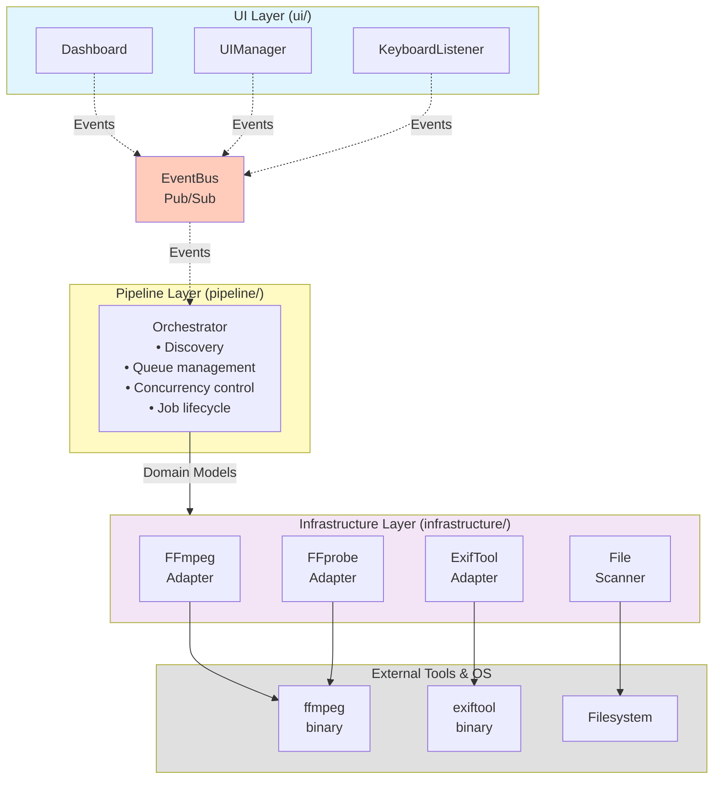

# Architecture Overview

VBC follows **Clean Architecture** principles with clear separation of concerns, dependency injection, and event-driven communication.

## Design Principles

1. **Dependency Inversion**: High-level modules don't depend on low-level modules. Both depend on abstractions (events, interfaces).
2. **Single Responsibility**: Each class has one reason to change.
3. **Event-Driven**: Components communicate via `EventBus` for loose coupling.
4. **Testability**: Dependency injection enables easy mocking and unit testing.
5. **Type Safety**: Pydantic models ensure configuration and data validation.

## Layer Architecture



## Directory Structure

```
vbc/
├── __init__.py
├── main.py                  # Entry point (Typer CLI)
│
├── config/                  # Configuration layer
│   ├── loader.py           # YAML loading logic
│   └── models.py           # Pydantic config models
│
├── domain/                  # Core business logic (framework-agnostic)
│   ├── models.py           # VideoFile, CompressionJob, VideoMetadata
│   └── events.py           # Domain event definitions
│
├── infrastructure/          # External adapters (replaceable)
│   ├── event_bus.py        # Pub/Sub event system
│   ├── logging.py          # Logging configuration
│   ├── file_scanner.py     # Recursive directory scanner
│   ├── exif_tool.py        # ExifTool wrapper
│   ├── ffprobe.py          # FFprobe wrapper
│   ├── ffmpeg.py           # FFmpeg compression wrapper
│   └── housekeeping.py     # Cleanup service
│
├── pipeline/                # Processing coordination
│   └── orchestrator.py     # Main orchestrator (792 LOC)
│
└── ui/                      # User interface (Rich-based)
    ├── state.py            # Thread-safe UI state
    ├── manager.py          # Event -> UI state mapper
    ├── keyboard.py         # Keyboard listener
    └── dashboard.py        # Rich Live dashboard
```

## Component Responsibilities

### Config Layer

**Purpose**: Load and validate configuration from YAML + CLI overrides.

- `models.py`: Pydantic models with validation rules
- `loader.py`: YAML parsing and CLI merging logic

**Key Models**:
- `AppConfig`: Root configuration
  - `GeneralConfig`: Core settings (threads, CQ, GPU, etc.)
  - `AutoRotateConfig`: Rotation patterns

### Domain Layer

**Purpose**: Business entities and rules (no external dependencies).

- `models.py`: Core data structures
  - `VideoFile`: Input file with metadata
  - `VideoMetadata`: Codec, resolution, camera, etc.
  - `CompressionJob`: Job state and results
  - `JobStatus`: Enum (PENDING, PROCESSING, COMPLETED, etc.)

- `events.py`: Domain events
  - `JobStarted`, `JobCompleted`, `JobFailed`
  - `DiscoveryStarted`, `DiscoveryFinished`
  - `HardwareCapabilityExceeded`
  - `RefreshRequested`, `ActionMessage`

### Infrastructure Layer

**Purpose**: Interact with external systems (files, processes, libraries).

#### EventBus
- Synchronous Pub/Sub pattern
- Type-safe event subscriptions
- Decouples components

#### FileScanner
- Recursive directory traversal
- Extension and size filtering
- Yields `VideoFile` objects

#### ExifToolAdapter
- Wraps `pyexiftool` library
- Extracts camera model, GPS, metadata
- Enables dynamic quality matching
- Thread-safe (uses lock)

#### FFprobeAdapter
- Wraps `ffprobe` binary
- Extracts stream info (codec, resolution, FPS, color space)
- Faster than ExifTool for video streams

#### FFmpegAdapter
- Wraps `ffmpeg` binary
- Builds command-line arguments (GPU/CPU, rotation, filters)
- Monitors progress via stdout parsing
- Detects hardware capability errors
- Handles color space remuxing

#### HousekeepingService
- Cleanup `.tmp` files
- Cleanup `.err` markers (conditional)

### Pipeline Layer

**Purpose**: Orchestrate the compression workflow.

#### Orchestrator
- **Discovery**: Scan input directory, count files, filter already-compressed
- **Metadata caching**: Thread-safe cache to avoid redundant ExifTool calls
- **Decision logic**:
  - Determine CQ (default or camera-specific)
  - Determine rotation (manual override or regex pattern)
  - Check color space and fix if needed
- **Submit-on-demand**: Queue management with prefetch factor
- **Concurrency control**: Dynamic thread adjustment (ThreadController pattern)
- **Job lifecycle**: Submit → Process → Complete/Fail
- **Event emission**: Publish events for UI updates
- **Graceful shutdown**: Finish active jobs on 'S' key
- **Refresh**: Re-scan directory and add new files on 'R' key

### UI Layer

**Purpose**: Display real-time progress and handle user input.

#### UIState
- Thread-safe counters (completed, failed, hw_cap, etc.)
- Active jobs list
- Recent jobs deque (max 5)
- Pending files queue
- Throughput and ETA calculation

#### UIManager
- Subscribes to domain and UI keyboard events used by the dashboard
- Updates `UIState` based on events
- Decouples UI from business logic

#### KeyboardListener
- Non-blocking daemon thread
- Reads stdin in raw mode
- Publishes events: `ThreadControlEvent`, `RequestShutdown`, `RefreshRequested`

#### Dashboard
- Rich Live context with auto-refresh
- 6 panels: Menu, Status, Progress, Processing, Recent, Queue, Summary
- Spinner animations
- Real-time throughput and ETA

## Data Flow

### Compression Job Lifecycle

```
1. Discovery Phase
   ┌────────────────┐
   │ Orchestrator   │
   │ .run()         │
   └───────┬────────┘
           │ scan directory
           ▼
   ┌────────────────┐
   │  FileScanner   │ → yields VideoFile objects
   └───────┬────────┘
           │ emit DiscoveryFinished
           ▼
   ┌────────────────┐
   │   EventBus     │ → UIManager updates UIState
   └────────────────┘

2. Job Submission Phase
   ┌────────────────┐
   │ Orchestrator   │
   │ submit_batch() │
   └───────┬────────┘
           │ create CompressionJob
           ▼
   ┌────────────────┐
   │ThreadPoolExecutor│ → _process_file(video_file)
   └────────────────┘

3. Processing Phase
   ┌────────────────┐
   │ _process_file()│
   └───────┬────────┘
           │ 1. Check .err markers
           │ 2. ffprobe (stream info)
           │ 3. Color space fix
           │ 4. Get metadata (ExifTool)
           │ 5. Filter (AV1/camera)
           │ 6. Determine CQ/rotation
           │ 7. Emit JobStarted
           ▼
   ┌────────────────┐
   │ FFmpegAdapter  │
   │ .compress()    │
   └───────┬────────┘
           │ ffmpeg subprocess
           │ monitor progress
           │ detect errors
           ▼
   ┌────────────────┐
   │Job Status Set  │
   │COMPLETED/FAILED│
   └───────┬────────┘
           │ 8. Copy metadata (ExifTool)
           │ 9. Check min ratio
           │ 10. Emit JobCompleted/JobFailed
           ▼
   ┌────────────────┐
   │   EventBus     │ → UIManager updates UIState
   └────────────────┘
```

## Concurrency Model

### ThreadController Pattern

VBC uses a **condition variable** for dynamic concurrency control:

```python
# Orchestrator._thread_lock (Condition)
with self._thread_lock:
    while self._active_threads >= self._current_max_threads:
        self._thread_lock.wait()  # Block until slot available

    if self._shutdown_requested:
        return

    self._active_threads += 1

# Process job...

with self._thread_lock:
    self._active_threads -= 1
    self._thread_lock.notify_all()  # Wake up waiting threads
```

**Benefits**:
- No polling, efficient blocking
- Runtime adjustments via keyboard (`<`/`>`)
- Graceful shutdown (set `_current_max_threads = 0`)

### Submit-on-Demand Pattern

Instead of submitting all jobs upfront, VBC uses a **deque** with dynamic submission:

```python
pending = deque(files_to_process)
in_flight = {}  # future -> VideoFile

def submit_batch():
    max_inflight = prefetch_factor * current_max_threads
    while len(in_flight) < max_inflight and pending:
        vf = pending.popleft()
        future = executor.submit(_process_file, vf)
        in_flight[future] = vf

# Submit initial batch
submit_batch()

# Process as they complete
while in_flight:
    done, _ = wait(in_flight, timeout=1.0, return_when=FIRST_COMPLETED)
    for future in done:
        future.result()
        del in_flight[future]
    submit_batch()  # Replenish queue
```

**Benefits**:
- Memory efficient (don't queue 10,000 futures)
- Responsive to thread changes
- Supports refresh (add new files mid-run)

## Event System

VBC uses a **synchronous Pub/Sub** event bus:

```python
# Publisher (Orchestrator)
self.event_bus.publish(JobStarted(job=job))

# Subscriber (UIManager)
def on_job_started(self, event: JobStarted):
    self.state.add_active_job(event.job)
```

**Representative events (domain + UI keyboard layer):**

| Event | Publisher | Subscribers | Purpose |
|-------|-----------|-------------|---------|
| `DiscoveryStarted` | Orchestrator | UIManager | Start discovery phase |
| `DiscoveryFinished` | Orchestrator | UIManager | Update file counts |
| `JobStarted` | Orchestrator | UIManager | Add to active jobs |
| `JobCompleted` | Orchestrator | UIManager | Update stats, move to recent |
| `JobFailed` | Orchestrator, FFmpegAdapter | UIManager | Increment error counters |
| `HardwareCapabilityExceeded` | FFmpegAdapter | UIManager | Track HW_CAP errors |
| `ThreadControlEvent` | KeyboardListener | Orchestrator, UIManager | Adjust thread count |
| `RequestShutdown` | KeyboardListener | Orchestrator, UIManager | Graceful shutdown |
| `RefreshRequested` | KeyboardListener | Orchestrator, UIManager | Re-scan directory |
| `ActionMessage` | Orchestrator, KeyboardListener | UIManager | User feedback (60s) |
| `QueueUpdated` | Orchestrator | UIManager | Update pending files queue |
| `ProcessingFinished` | Orchestrator | UIManager | All jobs done |
| `InterruptRequested` | KeyboardListener, Orchestrator | UIManager | Ctrl+C pressed |
| `ToggleOverlayTab` | KeyboardListener | UIManager | Open/close overlay tab |

**Benefits**:
- Loose coupling (UI doesn't know Orchestrator)
- Easy to add new subscribers (e.g., logging, webhooks)
- Testable (mock EventBus)

## Next Steps

- [Event System Details](events.md) - Deep dive into events
- [Pipeline Flow](pipeline.md) - Job lifecycle walkthrough
- [API Reference](../api/config.md) - Explore code
